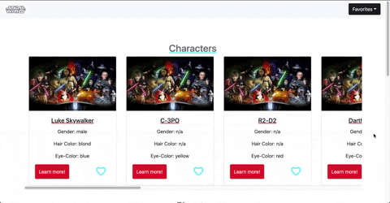
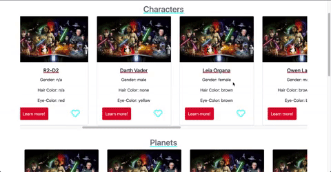
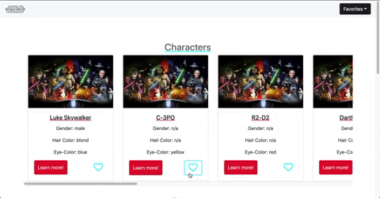

# Star Wars Blog

<h1 align="center">
  <br>
  
</h1>

<h4 align="center">An Interactive Star Wars Library</h4>

Presenting the front-end portion of a Star Wars Blog, a  full-stack interactive web application :computer: that provides access to a Star Wars fandom API. Meaning that you have access to a large amount of Star Wars information. It also includes a favorite list that allows you to store your favorite cards :raised_hands:. It incorporates JavaScript, Flux, Props, Bootstrap, and SCSS to build a convenient and user-friendly application. The possibilities are endless with access to so much information :rocket: , may the force be with you.

## Check it out!
👉 https://nizav.github.io/StarWars_Blog/

# Demo
### Browse


<br>
### Single Card View


<br>
### Select Favorites


<br>

## Installation
- Make sure you are using node version 10

1. Install the packages:
```
$ npm install
```
2. Create a .env file:
```
$ cp .env.example .env
```
3. Start coding!

Start the webpack server with live reload:

```
`$ npm run start` for windows, mac, linux or Gitpod.
```
